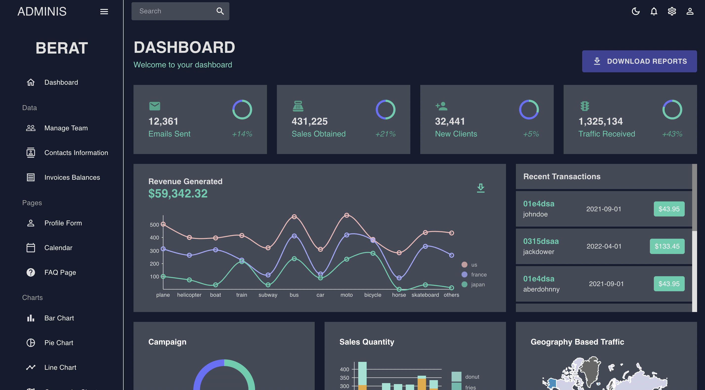
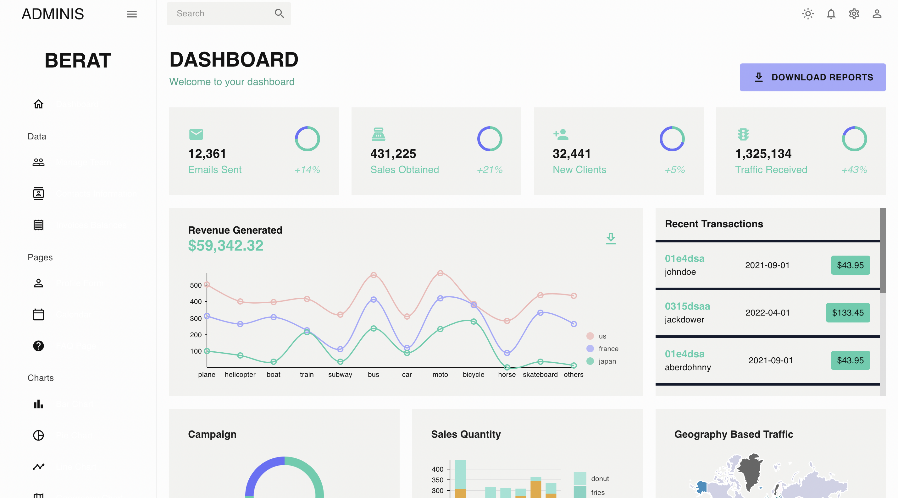
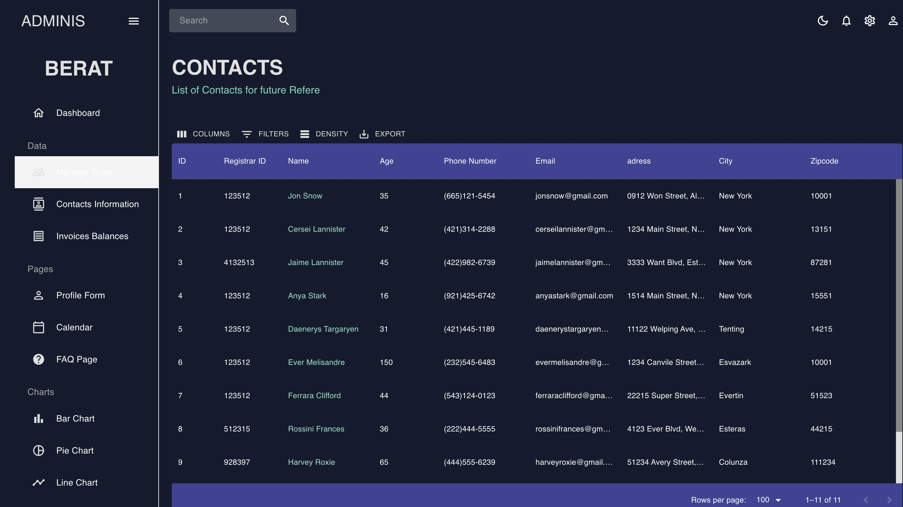
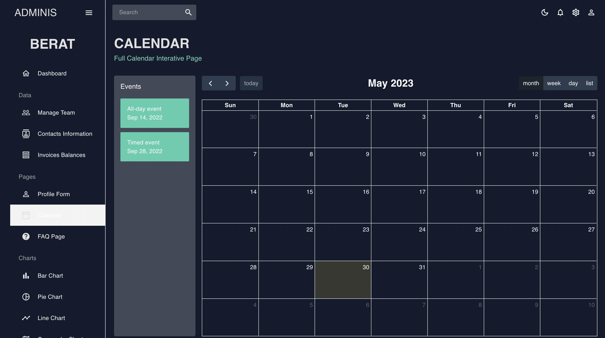
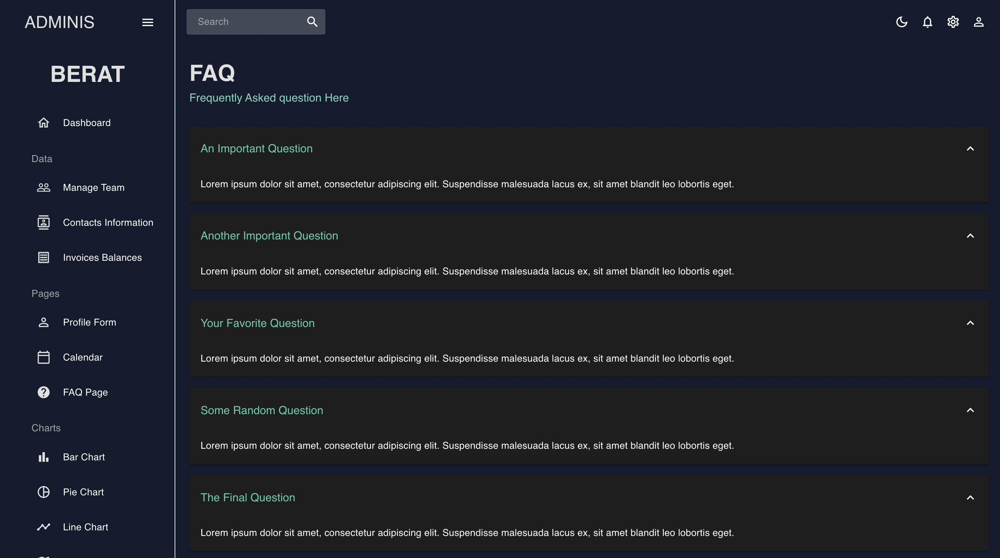
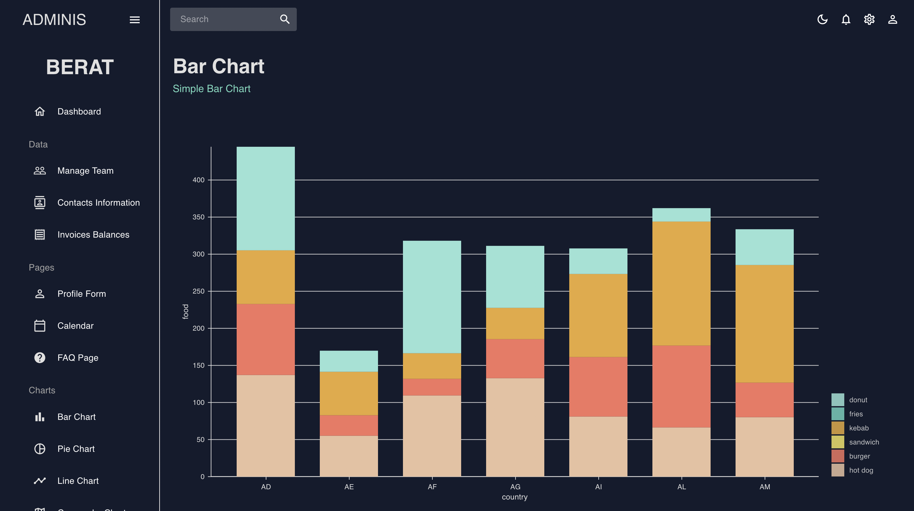
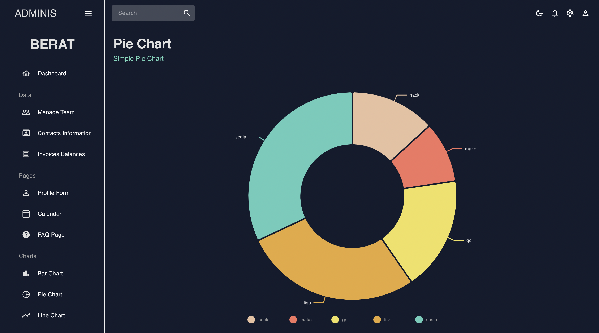
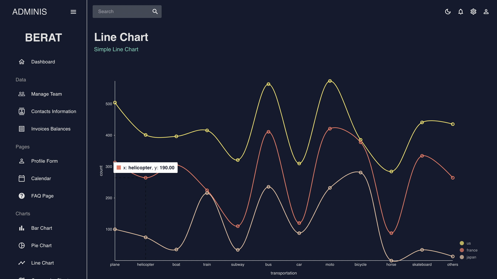
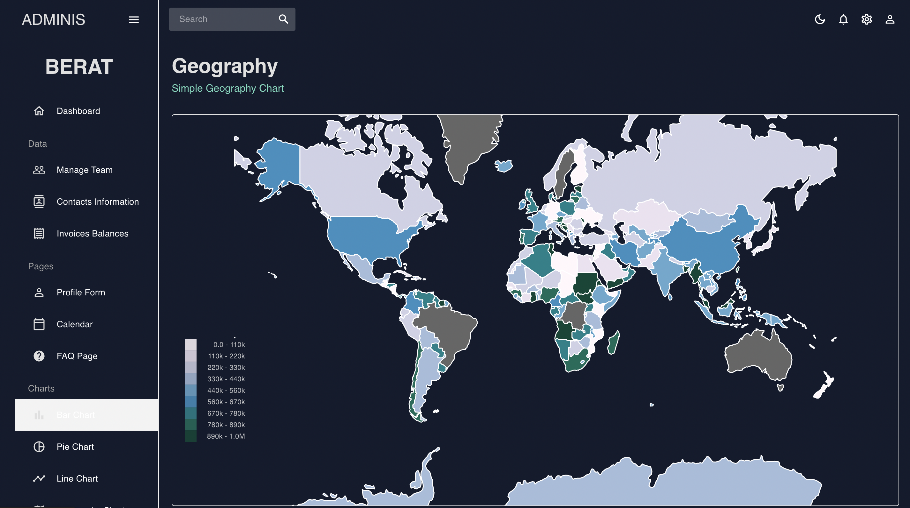
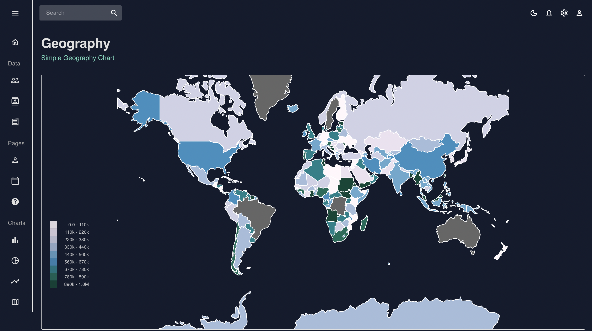

# Admin Dashboard


## **_Information_**

> An application for dashboard using React.js , Mui and Redux

<br>

## **_Configuration and Setup_**
<br>

> In order to run this project locally, simply fork and clone the repository or download as zip and unzip on your machine.

<br>

* Open the project in your prefered code editor.
* Go to terminal -> New terminal
* Follow these steps

<br>

> In the terminal

```bash
npm install (to install dependencies)
npm run start (to start the project)
```

<br> <br>

## **_Technologies Used_**

* [React](https://react.dev/learn) The library for web and native user interfaces

* [Mui](https://mui.com) MUI offers a comprehensive suite of UI tools to help you ship new features faster.

<br>

### **_Mui installation_**

#### npm:

```bash
npm install @mui/material @emotion/react @emotion/styled
```

#### yarn:

```bash
yarn add @mui/material @emotion/react @emotion/styled
```
<br>

* [Mui Icons](https://mui.com/material-ui/material-icons/) includes the 2,100+ official Material Icons converted to SvgIcon components. It depends on @mui/material, which requires Emotion packages

<br>

### **_Mui Icons installation_**

#### npm:

```bash
npm install @mui/icons-material @mui/material @emotion/styled @emotion/react
```

<br>

* [React hooks](https://reactjs.org/docs/hooks-intro.html) for managing application

* [react-router-dom](https://www.npmjs.com/package/react-router-dom) for managing router

<br>

### **_react-router-dom installation_**

#### npm:

```bash
npm i react-router-dom
```

<br>

* [Css](https://developer.mozilla.org/en-US/docs/Web/CSS) for UI

* [fullcalendar](https://fullcalendar.io) for draggable calendar

* [data-grid](https://mui.com/x/react-data-grid/) for filterable table

* [Accordion](https://mui.com/material-ui/react-accordion/) for accordion

* [nivo](https://nivo.rocks) for charts

* [react-pro-sidebar](https://www.npmjs.com/package/react-pro-sidebar) for sidebar

* [Formik](https://formik.org/docs/guides/validation) Formik is designed to manage forms with complex validation with ease

* [Yup](https://www.npmjs.com/package/yup) Yup is a schema builder for runtime value parsing and validation


<br><br>


## **_Getting Started with Create React App_**

This project was bootstrapped with [Create React App](https://github.com/facebook/create-react-app).

## Available Scripts

In the project directory, you can run:

### `npm start`

Runs the app in the development mode.\
Open [http://localhost:3000](http://localhost:3000) to view it in your browser.

The page will reload when you make changes.\
You may also see any lint errors in the console.

### `npm test`

Launches the test runner in the interactive watch mode.\
See the section about [running tests](https://facebook.github.io/create-react-app/docs/running-tests) for more information.

### `npm run build`

Builds the app for production to the `build` folder.\
It correctly bundles React in production mode and optimizes the build for the best performance.

The build is minified and the filenames include the hashes.\
Your app is ready to be deployed!

See the section about [deployment](https://facebook.github.io/create-react-app/docs/deployment) for more information.

### `npm run eject`

**Note: this is a one-way operation. Once you `eject`, you can't go back!**

If you aren't satisfied with the build tool and configuration choices, you can `eject` at any time. This command will remove the single build dependency from your project.

Instead, it will copy all the configuration files and the transitive dependencies (webpack, Babel, ESLint, etc) right into your project so you have full control over them. All of the commands except `eject` will still work, but they will point to the copied scripts so you can tweak them. At this point you're on your own.

You don't have to ever use `eject`. The curated feature set is suitable for small and middle deployments, and you shouldn't feel obligated to use this feature. However we understand that this tool wouldn't be useful if you couldn't customize it when you are ready for it.

## Learn More

You can learn more in the [Create React App documentation](https://facebook.github.io/create-react-app/docs/getting-started).

To learn React, check out the [React documentation](https://reactjs.org/).

### Code Splitting

This section has moved here: [https://facebook.github.io/create-react-app/docs/code-splitting](https://facebook.github.io/create-react-app/docs/code-splitting)

### Analyzing the Bundle Size

This section has moved here: [https://facebook.github.io/create-react-app/docs/analyzing-the-bundle-size](https://facebook.github.io/create-react-app/docs/analyzing-the-bundle-size)

### Making a Progressive Web App

This section has moved here: [https://facebook.github.io/create-react-app/docs/making-a-progressive-web-app](https://facebook.github.io/create-react-app/docs/making-a-progressive-web-app)

### Advanced Configuration

This section has moved here: [https://facebook.github.io/create-react-app/docs/advanced-configuration](https://facebook.github.io/create-react-app/docs/advanced-configuration)

### Deployment

This section has moved here: [https://facebook.github.io/create-react-app/docs/deployment](https://facebook.github.io/create-react-app/docs/deployment)

### `npm run build` fails to minify

This section has moved here: [https://facebook.github.io/create-react-app/docs/troubleshooting#npm-run-build-fails-to-minify](https://facebook.github.io/create-react-app/docs/troubleshooting#npm-run-build-fails-to-minify)


## **_Brief Pictures_**
Dashboard page includes charts



<br>

Dark-Light mode



<br>

Mui table - Datagrid



<br>

Calendar



<br>

Accordion



<br>

Bar Chart



<br>

Not Found



<br>

Pie Chart



<br>

Geography Chart



<br>

Sidebar



<br>
<br>

### **_Developer_**

* [Github](https://github.com/bekalhan) This is my github profile

* [Linkedln](https://www.linkedin.com/in/berat-kalhan-76a1391ba/) This is my  linkedln profile

* Email => beratkalhan99@gmail.com


<br><br>

### **_Other Projects_**

* [Getir Clone](https://github.com/bekalhan/getir-clone) => Try to make a new getir 

* [Blog Api](https://github.com/bekalhan/REBlog) => Blog api includes banned system , follow and unfollow , who view my profile and more using with nodejs

* [Blog UI](https://github.com/bekalhan/REBlog-Client) => Blog UI with mui

* [E-commerce App](https://github.com/bekalhan/technology) => making a e-commerce app with mern stack

* [Asp.Net Mvc](https://github.com/bekalhan/aspnet-mvc)


